# Style Grid for Forge

Style Grid replaces the default style dropdown with a fast, visual interface for browsing, selecting, and applying styles in all major Stable Diffusion WebUI builds.

It supports:
- category-based browsing
- source-aware filtering
- deduplicated All Sources view with source picker
- favorites and recent styles
- **LoRA cards** in a dedicated **🧬 LoRA** sidebar view (scanned from disk, read-only)
- drag reorder of selected styles
- presets, backup, import/export
- thumbnail generation/upload and cleanup tools
- optional CivitAI title enrichment for LoRAs (manual fetch)

See `CHANGELOG.md` for full release history.

---

## Installation

### Install from URL (recommended)
1. Open **Extensions** in Forge.
2. Go to **Install from URL**.
3. Paste this repository URL and install.
4. Restart Forge UI.

### Manual install
```bash
cd /path/to/stable-diffusion-webui-forge/extensions
git clone <this-repository-url> sd-webui-style-organizer
```
Restart Forge UI after cloning.

---

## Quick Start

1. Open `txt2img` or `img2img`.
2. Click the **Style Grid** trigger button to open the panel.
3. Pick a source (`All Sources` or a specific CSV).
4. Search or browse categories.
5. Click a style card to apply/unapply.
6. Use the **top bar** icon buttons (right of the search box) for presets, backup, import/export, etc.  
   *(The **📋 CSV table editor** slot is visible but **temporarily disabled** — hover for the tooltip.)*

## img2img support

Style Grid works in both generation tabs:
- txt2img
- img2img

Behavior is the same in both modes (source filter, deduplication, favorites/recent, context menus, previews, presets).
The small tab badge in the panel header shows the active host context.

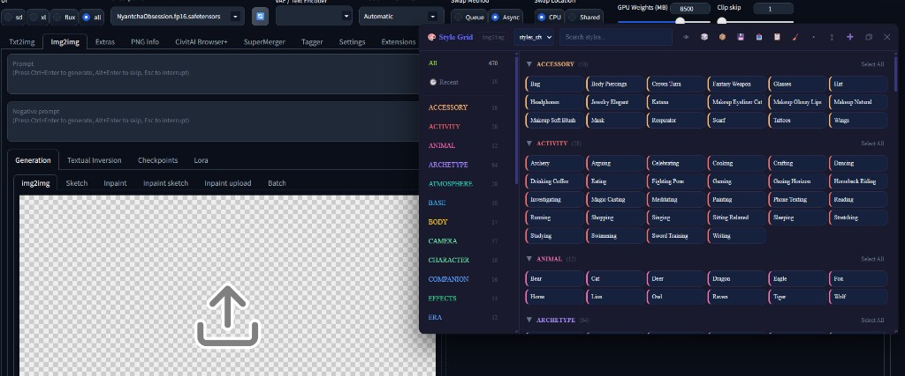

---

## Core Workflow

### 1) Browse and filter styles
- Use the left sidebar for category filtering.
- Use source dropdown for CSV-level filtering.
- Use search box for instant name filtering.

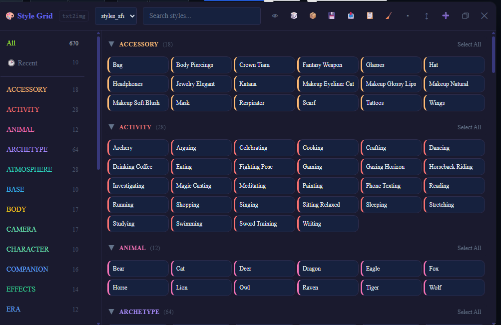

### Search and autocomplete
- Type in the search box to filter the grid in real time. Query tokens are **AND**-matched (whitespace-separated, case-insensitive).
- Grid search (`matchesSearch`) looks at the style **name** (including underscore→space forms) and **description**, with `Combos:` / `Conflicts:` reference lists stripped from the description so those lists do not pollute matches.
- Autocomplete suggestions use **name-only** matching (`matchesNameSearch`) and respect the active source filter (with All Sources, suggestions are deduped by name like the grid). Cap: top 8.
- **Favorites**, **Recent**, and **Presets** views also respect search and the active source filter (they previously ignored them).
- Use arrow keys + Enter to pick a suggestion quickly, or click the item with mouse.

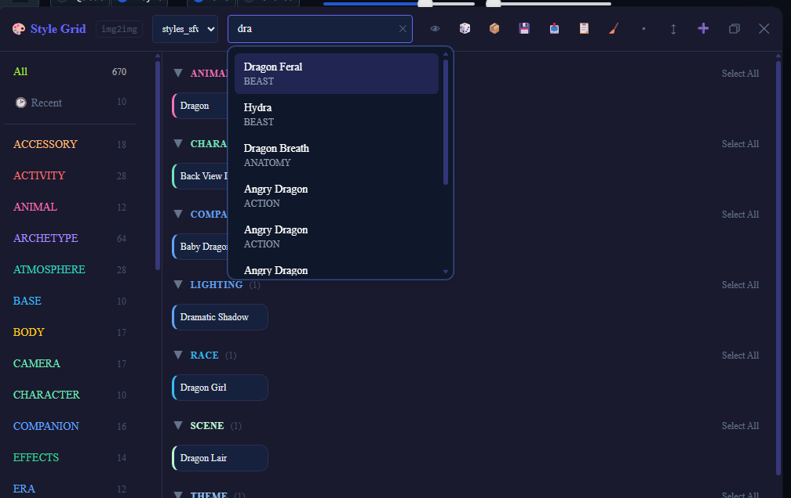

### 2) Apply styles from cards
- Card click toggles selection and applies/unapplies style.
- Selected styles are tracked in the bottom selected bar.
- Reorder selected styles by dragging chips in the selected bar.

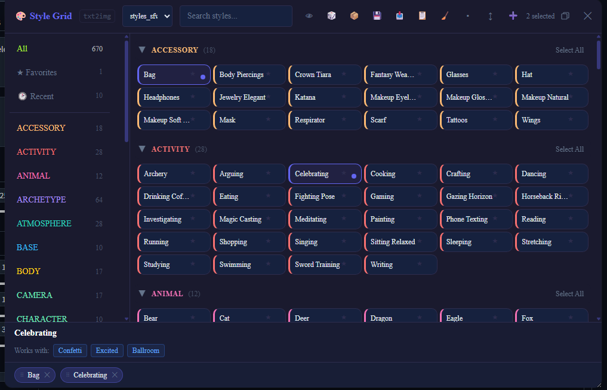

### 3) All Sources and duplicate names (source picker)
- With **All Sources** selected, the grid shows **one card per style name** even if that name appears in several CSV files.
- If the same name exists in more than one file, the **first click** on that card does not toggle the style yet — it opens a small **source picker** next to the card.
- The picker lists each duplicate as the **CSV file name only** (no folder path, no `.csv` extension). Choose the row you want; that variant is applied like a normal selection.
- Click outside the picker to close it without applying.
- If you pick a **specific source** in the dropdown, you always see that file’s styles only — duplicates from other files are not shown together, so the picker is not used.

### 4) Favorites, recent, and LoRA
- **Favorites:** right‑click a style card → **Add to Favorites** / **Remove from Favorites** (there is no star icon on the tile itself). Favorites and Recent are stored by **name + CSV source**, so the same name from two files can be favorited independently.
- **Recent** lists the last styles you applied (up to 10), grouped by category like the main grid.
- Open **Favorites** or **Recent** in the left sidebar to filter the grid to those lists (search + source filter apply here too).
- **🧬 LoRA** appears in the sidebar when at least one LoRA was scanned. Cards are synthetic styles (not CSV rows), grouped by sub-folder under your LoRA roots. See **LoRA support** below.

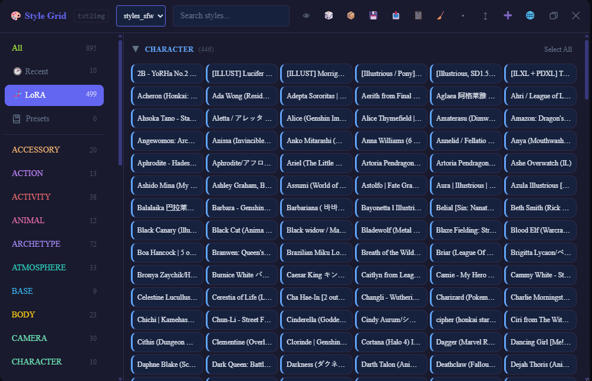

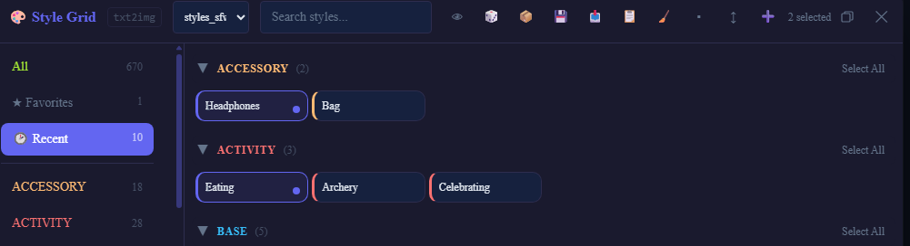

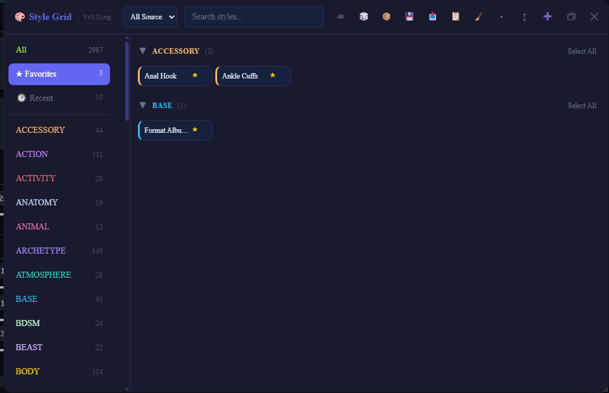

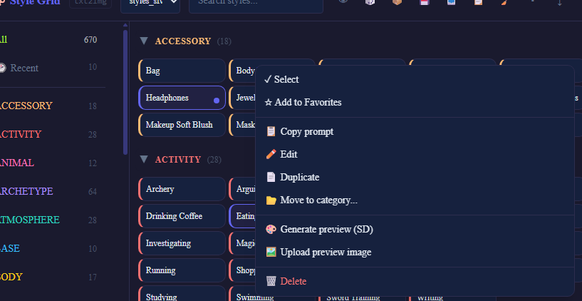

### 5) Category context menu: wildcards and previews

**Where to open it**

- **Right-click** a **category row** in the **left sidebar** (the colored category list).
- **Right-click** the **category header** in the **main grid** when the view is grouped by category (e.g. **All**, **Favorites**, **Recent** — the sticky row with `▼ CATEGORY (count)` and **Select All**).  
  *(A normal **left-click** on that header only collapses/expands the section.)*

**Menu actions**

| Item | What it does |
|---|---|
| **Add category as wildcard** | Inserts a token into the **positive prompt** on the Forge side: `{sg:<category>}`. The category name is normalized to **lowercase** to match how styles are grouped. |
| **Generate previews** | Queues **thumbnail generation** for styles in that category (batch job in the host). |

**How `{sg:…}` wildcards work**

- **Syntax:** `{sg:<category>}` — curly braces, the prefix `sg:`, then the **category label** as it appears in Style Grid (e.g. `ACCESSORY` or `accessory`). Only this pattern is special; the regex is `\{sg:…\}` (see `stylegrid/wildcards.py`).
- **When it runs:** tokens are expanded **at generation time** inside Style Grid’s own processing hook (`scripts/style_grid.py`), **before** the rest of the prompt is handled like a normal Forge prompt.
- **What gets inserted:** one **random** style from that category; the replacement text is that style’s **`prompt`** field from CSV (not `negative_prompt`). Category matching is **case-insensitive**.
- **Source-aware pool:** if a specific CSV is selected in the source filter, wildcard replacement picks styles only from that source; with **All Sources**, it uses the merged style pool.
- **Where you can put it:** positive or negative prompt box — **both strings are scanned**. If the category is unknown or empty, the `{sg:…}` text is **left as-is** (no error).
- You can type or paste tokens manually; the context menu only inserts the same format.

**Compatibility with other “wildcard” extensions (e.g. `stable-diffusion-webui-wildcards` / Dynamic Prompts `__file__` style)**

- Those stacks usually recognize **different** syntax — commonly **`__name__`** (double underscores) or other Dynamic Prompts / custom grammar — not `{sg:…}`.
- Style Grid only looks for **`{sg:…}`**; other extensions only interpret **their** patterns. The two do **not** use the same delimiters, so they **do not fight over the same text** in normal use.
- **You do not need** the Automatic1111 wildcards extension (or any extra wildcard plugin) **for Style Grid’s `{sg:…}` feature** — it is implemented **inside this extension** (Python `resolve_sg_wildcards` + your style CSV data). Other wildcard extensions remain optional for their own `__…__` / file-based workflows.

**Generate previews — sidebar vs grid**

- From the **grid** header menu, **Generate previews (N missing)** appears only when the UI thinks **N** styles in that category still need a cached preview.
- From the **sidebar** category menu, **Generate previews…** is always shown for that category (full pass for the category).

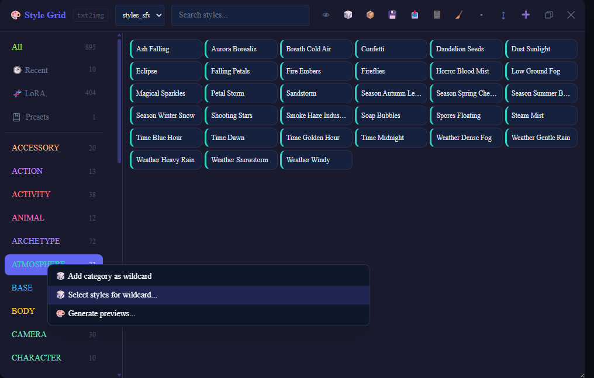

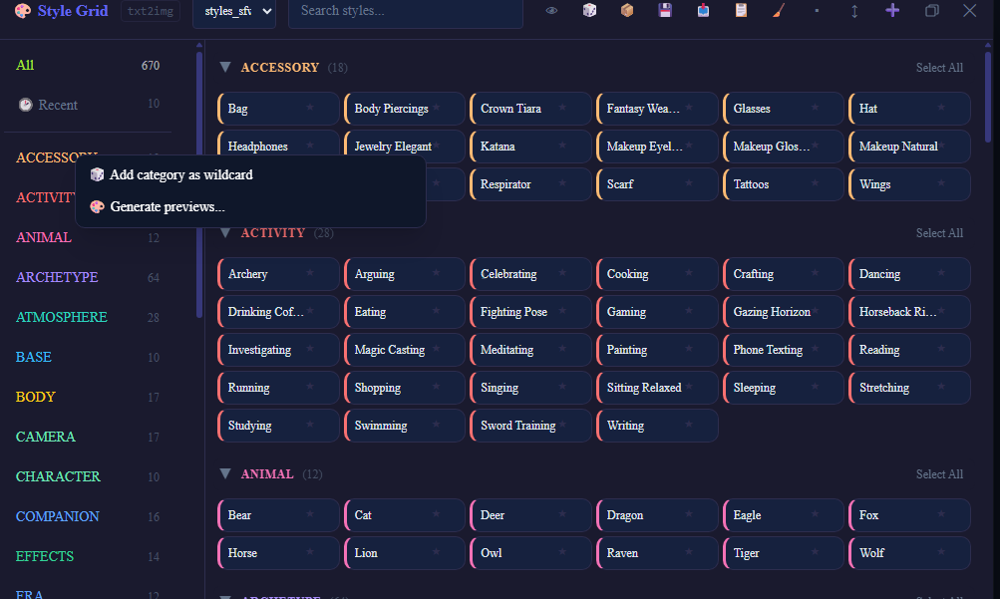

### 6) Style card context menu

**Where to open it**

- **Right-click** a **style card** in the grid. *(Left-click still applies the normal select / source-picker rules.)*

**Menu actions**

| Item | What it does |
|---|---|
| **Select** / **Deselect** | Same as a left-click on the card: applies or removes the style from the active selection (and host prompt), without opening the duplicate-source picker. |
| **Add to Favorites** / **Remove from Favorites** | Toggles the star list for this style **row** (name + source). |
| **Copy prompt** | Copies this style’s **`prompt`** text to the clipboard. |
| **Edit** | Opens the host **style editor** for this style. |
| **Duplicate** | Opens the host flow to duplicate the style (typically into the same or chosen source). |
| **Move to category…** | Opens the host dialog to change the style’s **category** field. |
| **Generate preview (SD)** | Runs **thumbnail generation** for this style (Stable Diffusion–based preview in the host). |
| **Upload preview image** | Opens the host **file picker** to set a custom thumbnail image. |
| **Remove preview image** | Deletes the cached WebP for this style’s **name + source** (surfaces errors instead of silently no-oping). |
| **Delete** | Removes the style (host confirms and updates CSV). Styles from the shipped **`samples/`** pack cannot be modified via the API (read-only). |

**LoRA cards:** Edit / Duplicate / Move / Generate preview / Upload preview / Remove preview / Delete are **hidden**. Select, Favorites, and Copy prompt remain. The server also rejects CSV save/delete for LoRA-sourced rows.

Click **outside** the menu, or move the pointer **off** the menu panel, to close it.

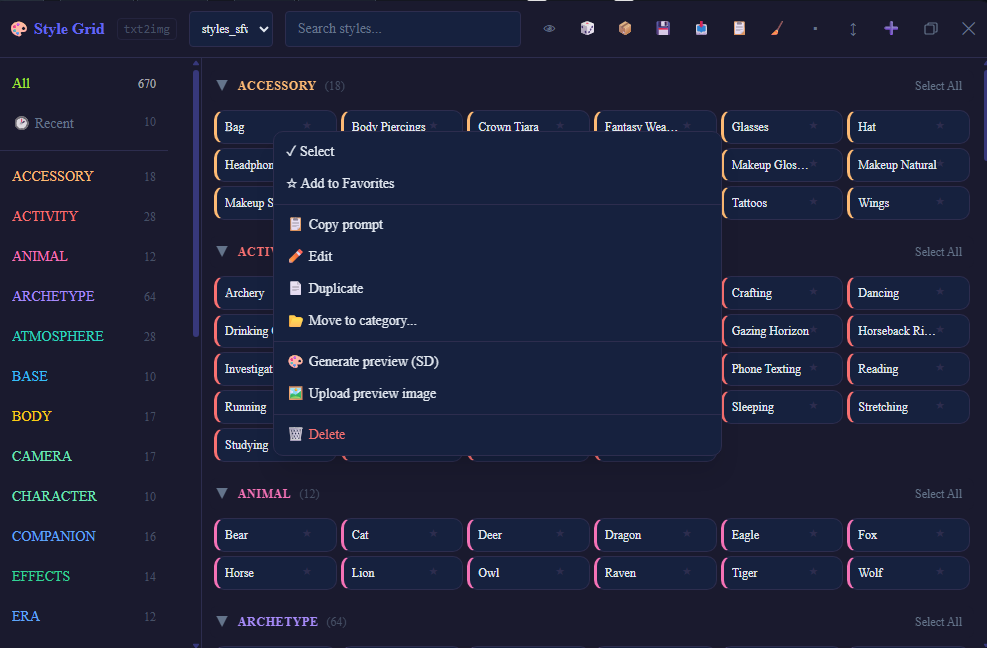

### 7) Thumbnail previews and the hover popup

**Generating a preview**

- **Per style:** open the style’s context menu (**right-click** the card) → **Generate preview (SD)**. The host runs an SD render and saves an image under `data/thumbnails/` (see **Data and Persistence**).
- **Per category:** use the **category** context menu → **Generate previews…** (see §5).

After a successful run, the iframe is notified so the UI can refresh that style’s thumbnail version.

Thumbnail images are loaded via `GET /style_grid/thumbnail?name=…&source=…` (CSV styles **require** `source` = that row’s `source_file`). Preview URLs may also include a version for browser cache. **Generate / upload / delete** send the same source identity so duplicate names across CSVs keep separate previews. Generation is queued (`job_id`); the host polls status and can cancel.

**What the card shows**

- The **grid card** is a compact label (name and category color accent). The **generated image is not shown inside the tile** — you see it when you **hover**.

**Hover popup (preview window)**

- **Pause ~300 ms** on a card to open the popup (reduces flicker when moving the mouse quickly).
- **Top:** the thumbnail image (if the file exists and loads). If the image is missing or fails to load, you still get the **text** below.
- **Title:** the style display name.
- **Prompt:** first **120 characters** of the style’s **`prompt`** column, with `...` if longer.
- **Negative:** first **60 characters** of **`negative_prompt`**, prefixed with **−** and shown in a muted red tone.

The popup is **fixed** near the card and flips **above** or **below** depending on available space.

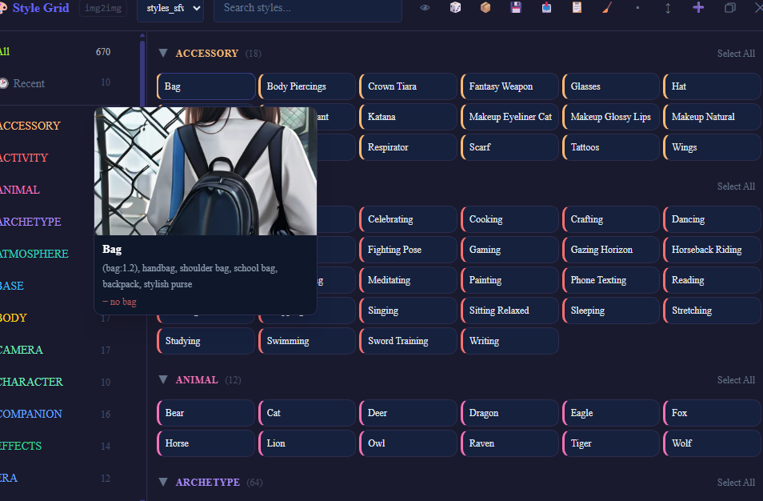

---

### 8) Fullscreen mode

- Click the **Fullscreen** button in the top-right corner of the panel to switch between floating window mode and edge-to-edge view.
- Fullscreen gives the grid and sidebar more horizontal space, which is useful for large category lists and long browsing sessions.
- Click the same button again to return to the regular floating panel size.

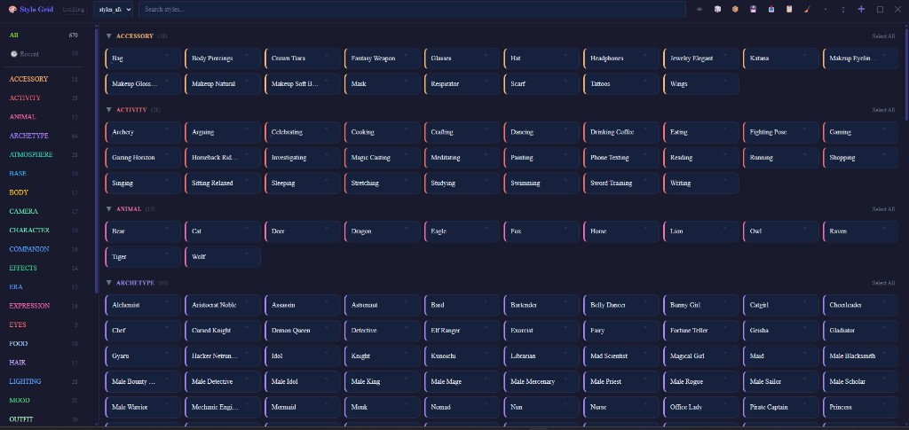

## Top bar (icon buttons on the right)

**What this means:** not a separate “toolbar” window — it is the **top header row** of the Style Grid panel: logo, `txt2img`/`img2img` tag, **source** dropdown, **search**, then a row of **small icon buttons on the right**. Hover an icon to see its tooltip.

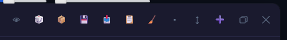

| Control | What it does |
|---|---|
| 👁 | **Silent mode** — styles are applied **at generate time** (hidden JSON on the Forge host), not in the prompt text fields. Turning silent **off** clears that host list, so **the next generation no longer uses silent injection**. The V2 grid may still **look** as if styles are selected (highlight/chips/count) until you click them or use Clear — that is **visual only** and does not change what silent mode already cleared for generation. Toggling a style off while silent still updates the host list. |
| 🎲 | **Random style** — picks a random style (respects the active source filter). |
| 📦 | **Presets** — save/load/delete style sets from the host modal. **Load** runs the same **`loadPreset`** path as choosing a preset in the sidebar **Presets** view (iframe posts **`SG_LOAD_PRESET`**). Both clear/apply on the host and sync the V2 selected bar (`SG_CLEAR_SELECTION` / `SG_STYLE_APPLIED` per style). |
| 💾 | **Backup** — creates CSV backup snapshot(s) under `data/backups/`, keeping directory distinction (`styles/` vs `samples/` vs external paths) so same basenames do not overwrite each other. Failures, HTTP errors, or “nothing to copy” are reported via toasts (see `docs/API.md` § `/backup`). |
| 📥 | **Import / Export** — export/import styles, presets, usage. Style import is **rejected** if any imported name already exists in the library (toast/alert lists collisions); presets still merge. |
| 📋 | **CSV table editor** — **temporarily unavailable** (control is semi-transparent / disabled; tooltip explains this). The full-screen table UI is **not** opened. Implementation is preserved in **`javascript/style_grid.js`** as a block comment for maintainers who want to turn it back on; see `docs/DEVELOPMENT.md`. When re-enabled, it would target the **same CSV** as **New style** (a specific file in the source dropdown, not **All Sources**), using the persisted source filter. |
| 🧹 | **Clear** — clears all selected styles in the panel and on the host; restores the user’s base prompt/negative text instead of wiping the textareas. |
| ▪ | **Compact mode** — toggles a denser card layout. |
| ↕ | **Collapse all** or **Expand all** category sections (depends on current state). |
| ➕ | **New style** — creates a style in the **currently selected CSV** (`All Sources` must be switched to a specific file first). |
| 🌐 | **Fetch LoRA titles** — visible **only** in the **🧬 LoRA** sidebar view. Opt-in: calls CivitAI’s public API using `modelId` already present in each LoRA’s local `.json` metadata; caches titles under `data/lora_titles.json`. Rate-limited; reopen the panel after the run to see updated labels. |

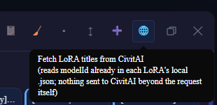

| *(number)* | Shows how many styles are selected; **⚠️** may appear if conflicts are detected (hover for details). |
| Fullscreen | Toggles between the floating panel size and edge-to-edge layout. |
| ✕ | **Close** — closes the Style Grid panel. |

---

## LoRA support

Style Grid can show installed LoRAs as style cards so they search, favorite, and apply/unapply like CSV styles.

| Topic | Behavior |
|---|---|
| Discovery | Best-effort auto-detect of Forge/A1111 LoRA dirs (`paths_internal.models_path/Lora`, `cmd_opts.lora_dir`, `cmd_opts.lyco_dir`), plus optional **`config/lora_roots.json`** (gitignored; copy from `config/lora_roots.json.example`). Roots are merged and deduped by **realpath** so junctions/symlinks do not double-scan. |
| Scan depth | Fully recursive unless `max_depth` is set in `lora_roots.json`. |
| Card identity | Synthetic `source_file` / source marker `__style_grid_lora__`. Style keys look like `LORA_<stem>` (disambiguated with relative folder when stems collide). Apply injects `<lora:stem:weight>` plus optional activation text from sibling metadata. |
| Metadata | Sibling `<stem>.json` (A1111/Forge extra-networks / CivitAI Browser+): preferred weight, activation / negative text, description/notes, `modelId`. |
| Previews | Only real sibling preview files (`*.preview.*` preferred, else bare image next to the model). **Never** SD-generated thumbnails for LoRA cards. |
| Sidebar | **🧬 LoRA** special view (shown when at least one LoRA was scanned). LoRAs are excluded from the CSV source dropdown and from normal category lists. |
| Titles | Optional **🌐** toolbar action fetches CivitAI model names via `GET https://civitai.com/api/v1/models/{id}` (manual only; sequential + throttled; retries HTTP 429). Successful titles become `display_name` on cards/hover. |
| Read-only | UI hides mutate actions; `save_style_to_csv` / `delete_style_from_csv` raise if `source_file` is the LoRA marker. |
| Rescan | `POST /style_grid/lora/rescan` invalidates the LoRA scan cache (see `docs/API.md`). |


---

## Data and Persistence

Generated files are stored in `data/`:

| File/Folder | Purpose |
|---|---|
| `data/presets.json` | Saved presets |
| `data/usage.json` | Usage counters |
| `data/category_order.json` | Persisted category order |
| `data/backups/` | CSV backups |
| `data/thumbnails/` | Thumbnail image cache (CSV styles) |
| `data/lora_titles.json` | Cached CivitAI LoRA titles (by `modelId`) |

Optional local config (not committed):

| File | Purpose |
|---|---|
| `config/lora_roots.json` | Extra LoRA scan roots / optional `max_depth` (see `.example`) |

Local UI state is also stored in browser localStorage (active source, favorites, recent, compact/collapse preferences).

---

## CSV Format

Primary style fields:
- `name`
- `prompt`
- `negative_prompt`
- optional metadata: `description`, `category`

Detailed specification: `docs/CSV_FORMAT.md`.

---

## API and Developer Docs

- API reference: `docs/API.md`
- Development guide: `docs/DEVELOPMENT.md`
- V2 React bundle (iframe loading, Zustand `useShallow`, `selectFilteredStyles`): `ui/README.md` (also overlaps with **GET `/style_grid/ui`** in `docs/API.md`).

---

## Troubleshooting

| Issue | What to check |
|---|---|
| Panel does not open | Extension enabled + full Forge restart. |
| Styles missing | CSV location/encoding/header correctness. |
| Source picker not shown | Must be in `All Sources`, and style must exist in multiple CSVs. |
| Order seems wrong | Check active source and category order persistence rules. |
| Thumbnails not appearing | Verify generation/upload status and `data/thumbnails/` permissions. CSV preview URLs and generate/upload/delete **must** include `source` (`source_file`). Generation is async by `job_id` — wait for completion / check cancel. LoRA cards only show sibling preview files on disk. |
| **🧬 LoRA** missing in sidebar | No scanned models yet — check Forge LoRA folder / `config/lora_roots.json`, then reload styles or `POST /style_grid/lora/rescan`. |
| LoRA titles still filenames after 🌐 | Wait for fetch to finish (toast), then **reopen the panel** so `/styles` reloads with cached `display_name`. HTTP 429 means rate limit; retry later (failed entries are retried on the next run). |
| Import fails with “names that already exist” | Rename or remove colliding styles in the export, or delete/rename the existing library entries first. LoRA synthetic names are excluded from the collision check. |
| Cannot edit/delete a sample style | Expected: CSVs under `samples/` are **read-only**. Copy the style into your own `styles/` CSV (or another writable source) first. |
| CSV table editor grayed out / toast “temporarily unavailable” | Expected: the feature is **disabled** by design. Edit styles per row via the **style editor** or CSV on disk; see `docs/DEVELOPMENT.md` to restore the table editor from the commented source. |

---

## Screenshots in this repo

PNG files live under `docs/screenshots/` and are named to match sections in this README. If the UI changes, replace the images but **keep the same filenames** (see `docs/screenshots/README.md` for a refresh checklist).

---

## License

AGPL-3.0 (`LICENSE`)
