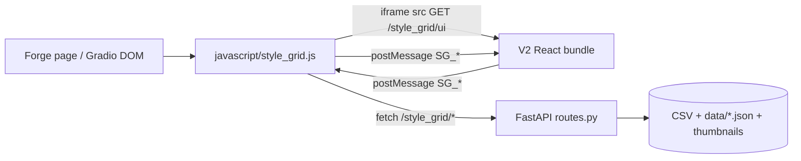

# Development Guide

## Current Architecture (V2)

The extension now uses a hybrid architecture:

- Host layer: `javascript/style_grid.js` (Forge page integration, iframe lifecycle, prompt-side effects).
- Backend API: `stylegrid/routes.py` and modules under `stylegrid/` (cache, CSV I/O, thumbnails, wildcards, **lora_scan**, **lora_titles**).
- UI app: `ui/` (React + TypeScript + Vite + shadcn-style components), served inside iframe.



## Repository Layout

```text
.
├─ javascript/style_grid.js           # Host integration + iframe bridge
├─ scripts/style_grid.py              # Forge script entrypoint (imports stylegrid.*)
├─ stylegrid/                         # Backend package
│  ├─ routes.py                       # FastAPI registration
│  ├─ cache.py / csv_io.py / …
│  ├─ lora_scan.py                    # Disk LoRA → synthetic styles
│  └─ lora_titles.py                  # Opt-in CivitAI title fetch + cache
├─ config/lora_roots.json.example     # Optional LoRA root overrides (user copies to lora_roots.json)
├─ ui/                                # React app (builds to ui/dist)
│  ├─ src/bridge.ts                   # Typed SG_* message contract (Style.display_name?)
│  ├─ src/store/stylesStore.ts        # selectFilteredStyles, matchesSearch, LORA_VIEW
│  └─ src/components/                 # UI building blocks
├─ tests/                              # pytest (csv_io, routes, wildcards); test_js.html
├─ docs/API.md
├─ docs/CSV_FORMAT.md
└─ docs/DEVELOPMENT.md
```

## Local Development

### Backend/host script

- Loaded by Forge from extension root; no separate backend server process.
- Main API registration path: `stylegrid/routes.py` → `register_api(...)` (imported from `scripts/style_grid.py`).

### UI app

```bash
cd ui
npm install
npm run build
```

The floating panel iframe loads **`GET /style_grid/ui`** (registered in `stylegrid/routes.py`). **`_get_ui_html()`** reads `ui/dist/index.html` and rewrites **all** relative `src` / `href` (`./…`) to Gradio **`/file=extensions/sd-webui-style-organizer/ui/dist/...`** with a **new** `?v=` timestamp on **each** HTTP response (not only the main bundle URLs). The host sets `frame.src` to **`/style_grid/ui?t=<Date.now()>`** so the document URL changes when the panel is created. After UI code changes, run **`npm run build`** in `ui/` so `ui/dist/` exists and matches `vite.config.ts`.

**V2 store / grid:** filtering for the style grid is implemented as an exported pure function **`selectFilteredStyles(...)`** in `ui/src/store/stylesStore.ts` (shared helpers include `dedupeStylesByNameForAllSources`, **`matchesSearch`**, **`matchesNameSearch`**). Favorites / Recent / presets / **🧬 LoRA** (`LORA_VIEW`) are special branches; normal category views **exclude** `source_file === LORA_SOURCE`. **`StyleGrid`** and **`Sidebar`** use Zustand **`useShallow`**. **`StyleGrid`** wraps **`selectFilteredStyles`** in **`useMemo`**.

**LoRA:** `get_cached_styles()` returns CSV cache + `get_cached_lora_styles()`. Optional roots: gitignored `config/lora_roots.json`. Title fetch is iframe-only (`App.tsx` → `POST /style_grid/lora/fetch_titles`); poll status every 1.5s while running. After titles land, reopen the panel so `/styles` reloads with `display_name`.
## Message Bridge (Host <-> Frame)

Bridge types are declared in `ui/src/bridge.ts`.

**Name+source identity:** Favorites / Recent use `styleRowKey(name, source_file)` in localStorage (legacy bare names migrate on style load). Presets store `{name, source_file}` (normalized on load). Host applied records remember apply-time `source_file`. V2 **`SG_APPLY`** always includes `source_file`; host resolve uses `findStyleByNameAndSource`. Thumbnail messages **`SG_GENERATE_PREVIEW` / `SG_UPLOAD_PREVIEW`** require `source`; host completion **`SG_THUMB_DONE`** includes `source_file` so duplicate-name cards cache-bust independently.

```mermaid
sequenceDiagram
  participant H as Host (style_grid.js)
  participant F as Frame (React UI)
  participant API as /style_grid/*

  F->>H: SG_READY
  H->>API: GET /style_grid/styles
  API-->>H: categories + usage
  H->>F: SG_INIT (styles array, silentMode)
  Note over F: Tab identity from SG_INIT only; SG_HOST_TAB ignored for per-frame tab
  F->>H: SG_APPLY (styleId + source_file) / SG_UNAPPLY / actions
  H->>API: CRUD/thumbnail/preset/etc requests
  H->>F: SG_STYLES_UPDATE / SG_TOAST / SG_THUMB_DONE (name+source) / progress
```

**Source filter ↔ host:** `SG_SOURCE_CHANGE` carries the selected CSV path (or `null` for All Sources). The host updates `state[tab].selectedSource` / `selectedSourceFile`, the visible source button label, and V1 localStorage via `setStoredSource`. V2 persists active source **per tab** (`sg_v2_last_source_*`) and **always** posts `SG_SOURCE_CHANGE` from `setStyles` (including All Sources) so Gradio clears stale paths. The store avoids echoing duplicate posts when the path is unchanged. **`SG_GENERATE_CATEGORY_PREVIEWS`** may include optional `source`; the host fetches `/style_grid/styles` and filters by category and that source so batch thumbnail jobs match the iframe’s active CSV.

**Iframe routing:** Forge mounts **two** Style Grid iframes (txt2img / img2img). Each tab’s `window.addEventListener("message", …)` must ignore events where `event.source !== frame.contentWindow`, otherwise both handlers would run for every postMessage (wrong tab, wrong `selectedSource`, etc.).

**Thumbnails:** Cached CSV files live under `data/thumbnails/` via `get_thumbnail_path(name, source_file)` (required source). HTTP GET/upload/generate/delete require `source` for CSV styles — see `docs/API.md`. Generation uses the FIFO **`ThumbnailGenerationManager`**: poll `job_id`, cancel via `POST /thumbnail/cancel`. Missing-preview counts come from `GET /thumbnails/list` (`{name, source_file}`), not bare-name localStorage. Per-style generate/upload posts the style’s `source_file` on the bridge (not only the active filter).

**Silent mode:** injection for `scripts/style_grid.py` `process()` reads the hidden Gradio component `style_grid_silent_<tab>` (JSON array of `{name, source_file}` or legacy bare names, ordered by `selectedOrder`). The host keeps that in sync via `setSilentGradio()` from `state[tab].selected` while `silentMode` is on. `SG_UNAPPLY` must remove the id from both `applied` and `selected`; `SG_TOGGLE_SILENT` with `value: false` runs `clearHostSilentSelection` and `postClearSelectionToIframes` (`SG_CLEAR_SELECTION`). Turning silent **on** converts live applies into silent records (strip prompt deltas). Every **`SG_INIT`** includes `silentMode`; V2 hydrates via `setState` without posting `SG_TOGGLE_SILENT`. `{sg:…}` wildcards also resolve inside silently injected style text. **Source of truth for generation is the host textbox**, not the iframe selection UI: after silent turns off, V2 may still show tiles/chips as selected until the user toggles or clears — that mismatch is visual-only and must not imply silent styles are still injected.

**Apply / unapply (`SG_APPLY` / `SG_UNAPPLY`):** In **non-silent** mode the host must still maintain `state[tab].selected` and `selectedOrder` (not only in silent mode), because presets and other features read that set — applying a style adds the id and remembers `source_file` on the applied record; unapply removes it. This keeps **Save preset** consistent with what is actually selected. **Reorder** updates `selectedOrder` and rebuilds prompts from existing additive/wrap records (including wrap templates) without fabricating full-prompt deltas.

**Clear:** host `clearAll` restores textareas from `userPromptBase` / `userPromptBaseNeg` instead of wiping typed user text. That snapshot usage is intentional and unchanged.

**Reorder base (`rebuildPromptFromOrder`):** does **not** read `userPromptBase` / `userPromptBaseNeg` at all. It derives the base from the **live** textareas by unwinding each applied style in reverse `state[tab].appliedNestOrder` (wrap templates stripped by prefix/suffix, additive tags via `removeSubstringFromPrompt`), re-appends in the new order, then re-records `appliedNestOrder = orderedApplied`. Why: the old snapshot was captured once when `applied.size === 0`, so anything typed or inserted afterwards — including `{sg:…}` tokens — was silently dropped on the next reorder.

**Prompt tokenization (`splitTopLevelCommas`):** brace-aware as well as paren-aware — a comma only splits when **both** depths are zero, so `{sg:cat:A,B}` stays one segment. Anything that tokenizes prompt text must use this helper rather than `.split(",")`, or slice tokens get shredded. Consumers: `removeWildcardCategory`, `reorderWildcardCategories`, `parseStylePromptTags`, `scalePromptWeights`.

**Floating panel outside-click:** `initSGFrame` registers a capture-phase `document` `mousedown` listener to hide the wrapper when clicking outside. Clicks on `.sg-editor-overlay` or `.sg-source-picker` are excluded so **host overlays** (editors, duplicate-source picker) do not dismiss the Style Grid frame.

**Backup (`SG_BACKUP`):** The iframe posts `SG_BACKUP`; the host `fetch`es `POST /style_grid/backup`, checks `response.ok` before `json()`, and maps `{ error }`, `{ ok: false }`, and thrown errors to **`SG_TOAST`**. Backup members keep directory distinction (`styles/` vs `samples/` vs `external/…`). See `docs/API.md` § POST `/backup`.

**Import:** failed `POST /import` (including name **collisions**) is shown to the user (alert with error + colliding names); success path unchanged.

**Presets — Load:** **`loadPreset(tabName, presetName)`** (shared by the modal **Load** button and the iframe) clears the selection, posts **`SG_CLEAR_SELECTION`**, applies each saved style with name+source resolve (`applyStyleImmediate`, host `.sg-card` classes), posts **`SG_STYLE_APPLIED`** per resolved style, and calls **`updateSelectedUI`**. The classic presets UI (`showPresetsMenu`) runs on the host DOM and calls **`loadPreset`** from the **Load** button.

The React sidebar **Presets** view (`activeCategory === 'presets'`) renders preset names with the same **`StyleCard`** component as ordinary styles (`presetName` prop); a click sends **`SG_LOAD_PRESET`** with the preset name. The host handler calls **`loadPreset(tab, name)`**; if **`state[tab].presets`** does not yet include that key, it **`fetch`es `GET /style_grid/presets/list`**, merges into **`state[tab].presets`**, then invokes **`loadPreset`** — so loading from the iframe works even when the host cache was empty. V2 preset category filter accepts dual-format `{name, source_file}` entries.

**Thumbnail hover:** **`ThumbnailPreview`** skips the hover popup wrapper when **`presetName`** is set (preset tiles are name-only; no thumbnail preview for the preset name string).

**Forge script outputs:** `StyleGridScript.ui()` still creates `style_grid_data_*`, `style_grid_selected_*`, the silent textbox, and the apply trigger, and returns **`[silent_styles, source_filter]`**. In `process(*args)`, `args[0]` is silent JSON and `args[1]` is the active source filter (empty string = All Sources) used to scope `{sg:...}` wildcard pools — paths compared via `normalize_source_path`. Wildcard resolution still runs over `p.all_prompts` / `p.all_negative_prompts` from the pipeline, not over hidden textbox values.

**CSV / samples:** `samples/` is read-only for save/delete (**403**). Basename resolve prefers writable CSVs over the demo pack (`is_samples_source`, `_resolve_target_csv_path`).

**CSV table editor (currently disabled):** The 📋 control appears in both the **React header** (`ui/src/App.tsx`, disabled `ToolBtn`) and the **classic host panel** toolbar (`javascript/style_grid.js`, disabled button after Refresh). Tooltips state that the editor is **temporarily unavailable**. The live `openCsvTableEditor` in the host script is a **no-op stub**; the previous full implementation is kept in a **block comment** directly above that stub (search for `CSV table editor — full implementation`). Styles for the overlay live in **`style.css`** under `.sg-csv-*` and `.sg-csv-editor-btn-disabled`.

- **`SG_CSV_EDITOR`:** The iframe message type remains in `ui/src/bridge.ts` for typing, but the React button does not send it while disabled. If something posts `SG_CSV_EDITOR`, the host answers with **`SG_TOAST`** (`info`) instead of opening the editor; the original handler body is **commented** next to the active branch in `initSGFrame`’s `message` listener.
- **Re-enabling (outline):** (1) Uncomment the large block and remove the stub `openCsvTableEditor`. (2) Uncomment the old `SG_CSV_EDITOR` handler and remove or replace the toast-only branch. (3) Re-enable the host 📋 button (remove `disabled`, wire `openCsvTableEditor` again) and the React `ToolBtn` (`disabled` off, `onClick: () => sendToHost({ type: 'SG_CSV_EDITOR' })`).  
- **Behavior when active (for reference):** The real editor resolved the target file from **`getStoredSource(tab)`** (localStorage-backed), not a stale dropdown snapshot. **All Sources** was rejected up front. The iframe-triggered path used the **visible** Forge tab (`style_grid_wrapper_*` visibility) to pick `txt2img` vs `img2img`.

**DOM:** `qs(sel, root?)` queries from `root` when provided, otherwise falls back to `gradioApp()` when available.

## Data and Persistence

- `data/presets.json`: presets storage.
- `data/usage.json`: usage counters.
- `data/category_order.json`: backend-persisted category order.
- `data/thumbnails/`: thumbnail files (CSV styles).
- `data/backups/`: CSV backups.
- `data/lora_titles.json`: CivitAI title cache keyed by `modelId` (created on first successful/failed fetch).
- `config/lora_roots.json`: optional user LoRA roots (gitignored; see `.example`).

Client-side localStorage keys are also used for UI state (`favorites` / `recent` as name+source composite keys, per-tab source filter, collapsed categories, etc.).

## Testing

| Layer | How |
|-------|-----|
| **Python** | `python -m pytest tests/ -q` — CSV I/O, HTTP routes, `{sg:…}` wildcards (`tests/README.md`). |
| **JS prompt helpers** | Open `tests/test_js.html` in a browser (no server). |
| **UI** | Included in root `npm run lint` via `lint:ui` (`npm --prefix ui run lint`). No Jest/Vitest suite yet. |

Gaps worth knowing: React/iframe logic and `javascript/style_grid.js` are not covered by CI automation; regressions are caught by manual QA or future e2e tests.

## Practical Notes

- Keep **`selectFilteredStyles`** (grid) and host-side style payload behavior aligned. If host dedups too early, source-aware UI features (like source picker on dedup cards) cannot work correctly.
- Category ordering logic should remain source-aware: All Sources behavior and specific-source behavior are intentionally different.
- When changing bridge messages, update both `ui/src/bridge.ts` and host `window.addEventListener("message", ...)` handlers (both iframe instances).
