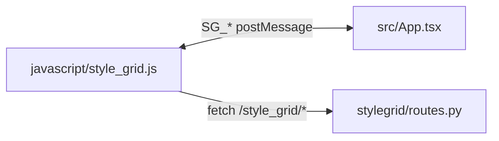

# Style Grid UI (V2)

React + TypeScript + Vite frontend loaded by Forge inside an iframe.

## Commands

```bash
cd ui
npm install
npm run build
```

`npm run build` outputs `ui/dist/`. The Forge host loads the UI with **`GET /style_grid/ui?t=<timestamp>`** (FastAPI in `stylegrid/routes.py`). **`_get_ui_html()`** in `stylegrid/routes.py` reads `ui/dist/index.html` and rewrites **each** relative `src` / `href` (`./…`) to Gradio **`/file=extensions/sd-webui-style-organizer/ui/dist/…`** with a **new** `?v=<unix time>` on every response so JS, CSS, favicon, and other linked assets stay in sync after rebuilds. The host script sets the iframe `src` in `javascript/style_grid.js`.

## Key Files

- `src/App.tsx`: top-level layout and toolbar actions.
- `src/store/stylesStore.ts`: Zustand state, actions, `categories()`, and exported pure **`selectFilteredStyles(...)`** (filtered + deduped list for the grid — not a store method).
- `src/bridge.ts`: typed SG_* postMessage contract with host.
- `src/components/StyleGrid.tsx`: main grid; subscribes with **`useShallow`** and **`useMemo(selectFilteredStyles(...))`**; sidebar **Presets** view renders preset names with `StyleCard` (`presetName` + `SG_LOAD_PRESET`).
- `src/components/Sidebar.tsx`: category list; **`useShallow`** subscription to limit re-renders.
- `src/components/StyleCard.tsx` / `ThumbnailPreview.tsx`: style tiles; optional `presetName` disables context menu, usage chip, and hover thumbnail preview.
- `src/components/*`: other UI (sidebar, modals, etc.).

## Integration Flow



Thumbnail **images** use `GET /style_grid/thumbnail?name=…` (server resolves paths from the cached style list; see `docs/API.md`). **SD preview generation** from the host uses `POST /style_grid/thumbnail/generate` with optional JSON `source` when a specific CSV row must be targeted.
