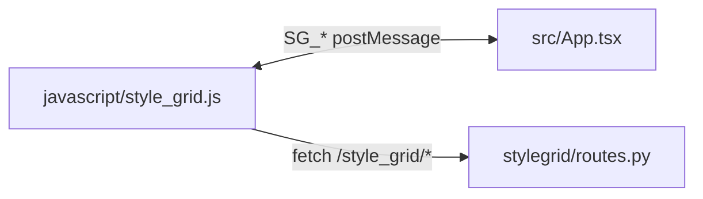

# Style Grid UI (V2)

React + TypeScript + Vite frontend loaded by Forge inside an iframe.

## Commands

```bash
cd ui
npm install
npm run build
```

`npm run build` outputs `ui/dist/`. The Forge host loads the UI with **`GET /style_grid/ui?t=<timestamp>`** (FastAPI in `stylegrid/routes.py`). **`_get_ui_html()`** in `stylegrid/routes.py` reads `ui/dist/index.html` and rewrites **each** relative `src` / `href` (`./…`) to Gradio **`/file=extensions/sd-webui-style-organizer/ui/dist/…`** with a **new** `?v=<unix time>` on every response so JS, CSS, favicon, and other linked assets stay in sync after rebuilds. The host script sets the iframe `src` in `javascript/style_grid.js`.

## Key Files

- `src/App.tsx`: top-level layout and toolbar actions (including **🌐** LoRA title fetch when `activeCategory === LORA_VIEW`).
- `src/store/stylesStore.ts`: Zustand state; **`LORA_SOURCE`** / **`LORA_VIEW`**; exported **`selectFilteredStyles`**, **`matchesSearch`**, **`matchesNameSearch`** (token AND search; description strips `Combos:`/`Conflicts:`; Favorites/Recent/presets honor search + source).
- `src/bridge.ts`: typed SG_* postMessage contract; optional **`Style.display_name`**.
- `src/components/StyleGrid.tsx`: main grid; **`useShallow`** + **`useMemo(selectFilteredStyles(...))`**; LoRA view groups by category like Favorites/Recent.
- `src/components/Sidebar.tsx`: categories + special views (Favorites, Recent, **🧬 LoRA** when at least one LoRA was scanned).
- `src/components/StyleCard.tsx` / `ThumbnailPreview.tsx`: prefer `display_name` for labels; LoRA cards hide edit/preview/delete menu actions.
- `src/components/*`: other UI (sidebar, modals, etc.).

## Integration Flow


```mermaid
flowchart LR
  H[javascript/style_grid.js] <-->|SG_* postMessage| UI[src/App.tsx]
  H -->|fetch /style_grid/*| API[stylegrid/routes.py]
```

Thumbnail **images** use `GET /style_grid/thumbnail?name=…` (CSV resolution from cache; LoRA sibling previews when marked — see `docs/API.md`). **SD preview generation** from the host uses `POST /style_grid/thumbnail/generate` with optional JSON `source` when a specific CSV row must be targeted (blocked for LoRA).

**LoRA titles:** in the LoRA sidebar view, **🌐** → `POST /style_grid/lora/fetch_titles`, then poll `GET /style_grid/lora/fetch_titles/status` every 1.5s until not `running`. Reopen the panel after completion so cards pick up `display_name`.
